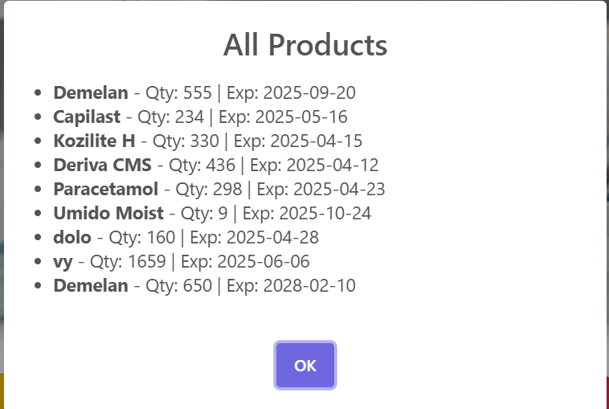
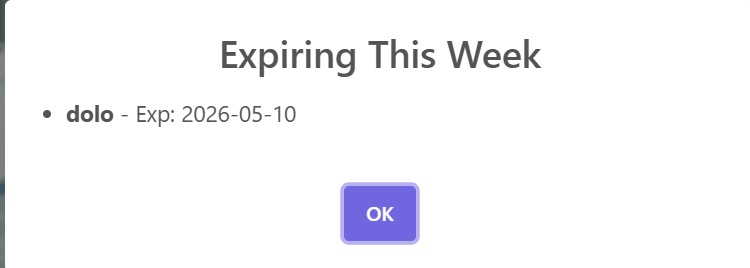
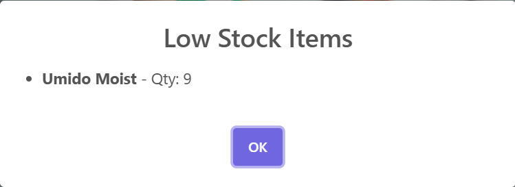
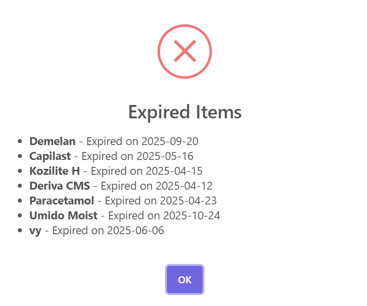
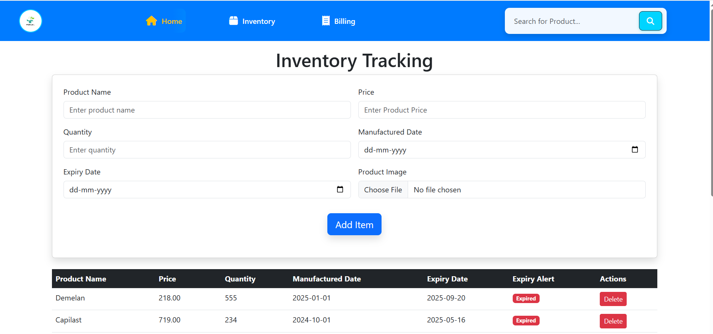
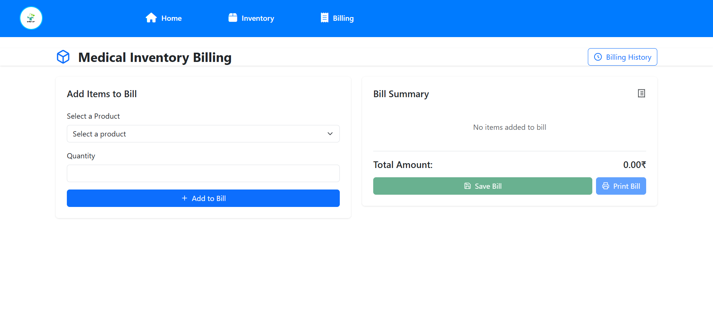
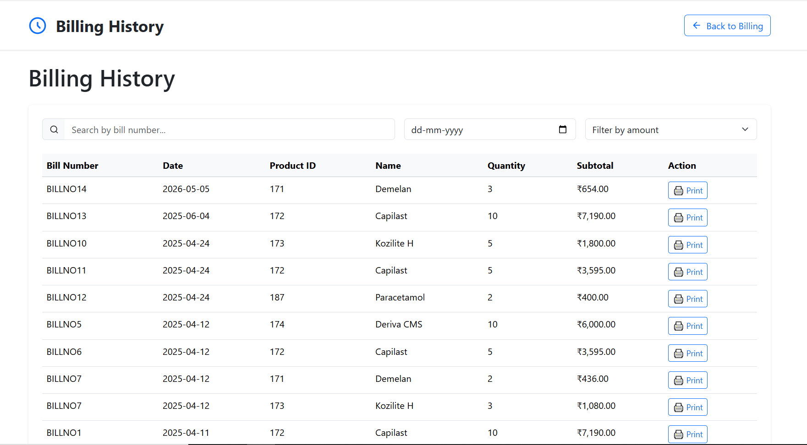
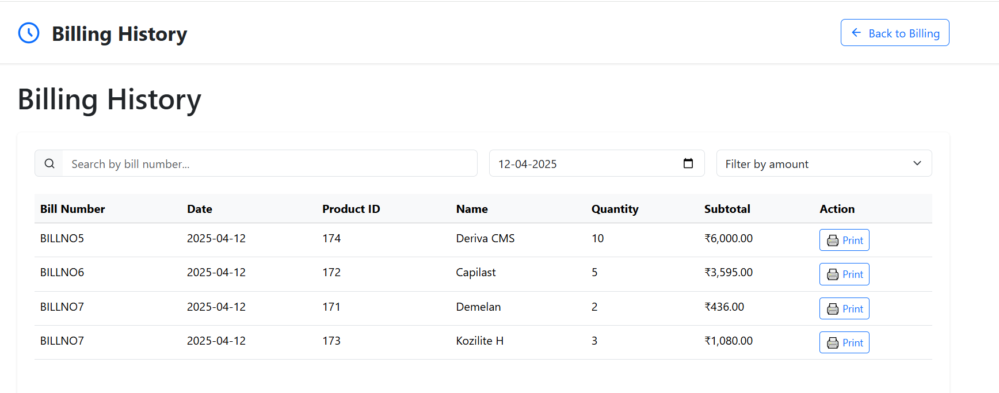
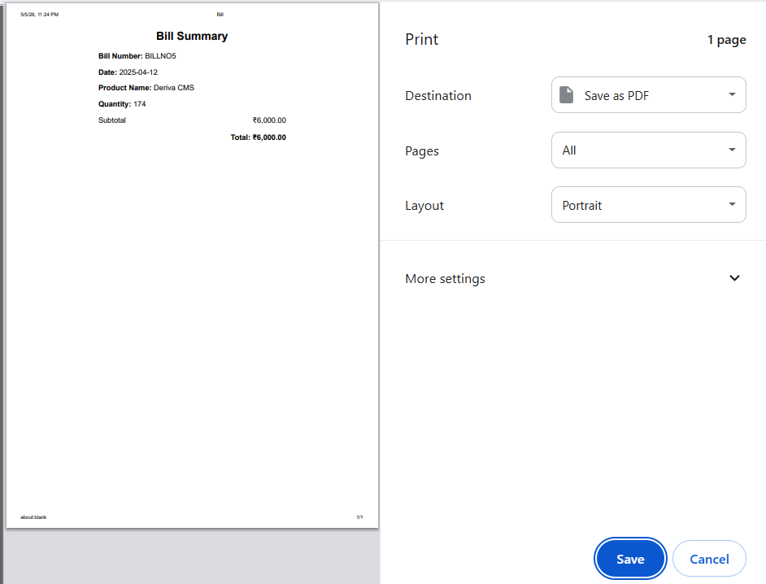
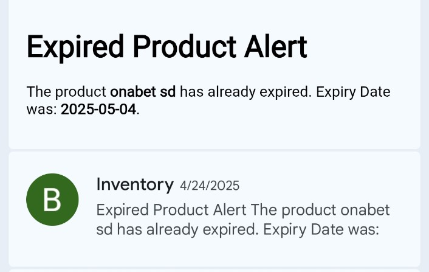

# 📦 Automated Expiry Alerts and Inventory Tracking System

## 📌 Project Description

This project is a web-based inventory management system that helps users track products and automatically get alerts when items are near expiry or expired.

It is useful for medical stores, supermarkets, and businesses that manage perishable products.

---

## 🚀 Features

* Add, update, and delete products
* Track product expiry dates
* Automatic expiry alerts
* Billing system with bill generation
* Product search functionality
* Email notification for expiry alerts
* Display product images

---

## 🛠️ Technologies Used

* Frontend: HTML, CSS, JavaScript
* Backend: PHP
* Database: MySQL
* Email Service: PHPMailer

---

## 📂 Project Structure

project/
│
├── inventory.php
├── Billing.php
├── alerts.php
├── login.php
├── registration.php
├── connection.php
├── save_bill.php
├── send_email.php
│
├── js/
├── css/
├── images/
├── uploads/
│
├── vendor/
├── PHPMailer/

---

## ⚙️ How to Run the Project

1. Install XAMPP/WAMP
2. Copy project folder to htdocs
3. Start Apache and MySQL
4. Import database in phpMyAdmin
5. Open browser and run:
   http://localhost/Automated_Expiry_Alert

---

## 📸 Screenshots

📝 Registration Page

🔐 Login Page

🏠 Dashboard

📦 Total Products

⏰ Expiring This Week

⚠️ Low Stock

❌ Expired Items

📊 Inventory Tracking

🧾 Billing

📜 Billing History

🔍 Filtered Billing

🖨️ Print Bill

📢 Expiry Product Alert

---

## 🎯 Future Improvements

* Dashboard with analytics
* SMS notification alerts
* Mobile responsive design

---

## 👩‍💻 Author

Bhagyashri Hande

---
